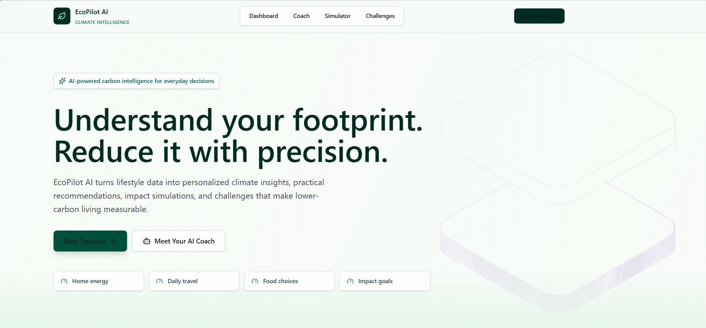
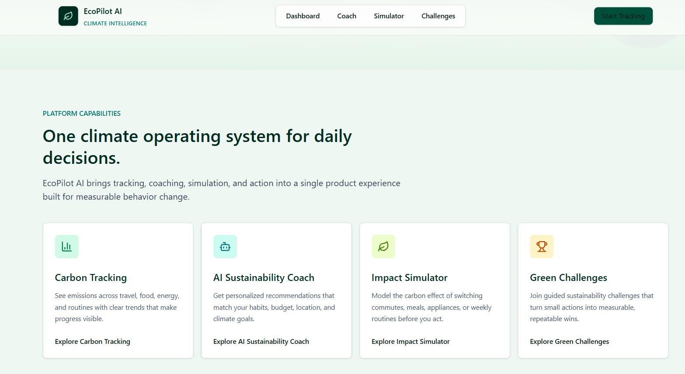
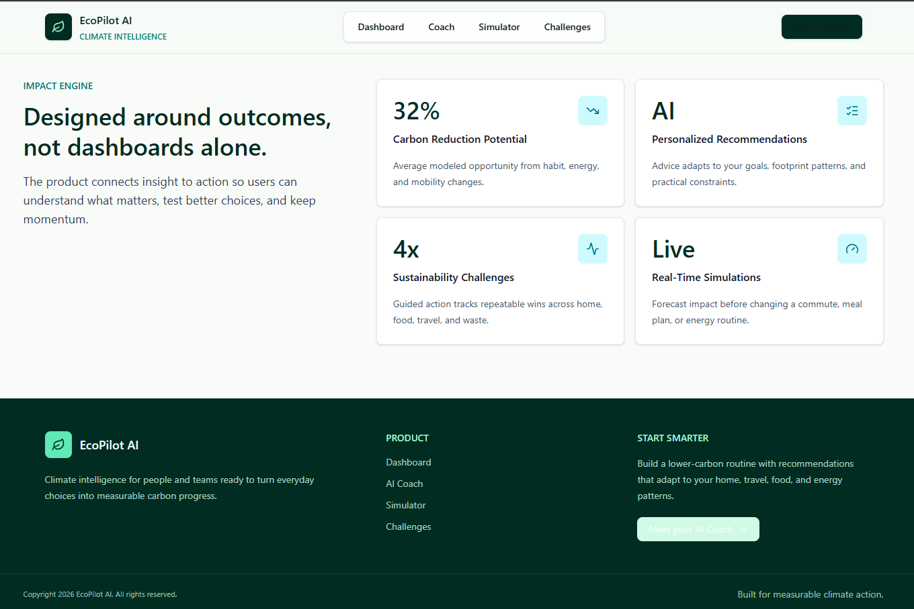
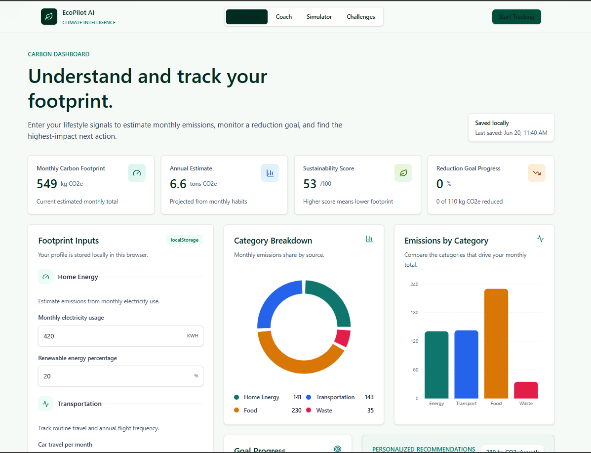
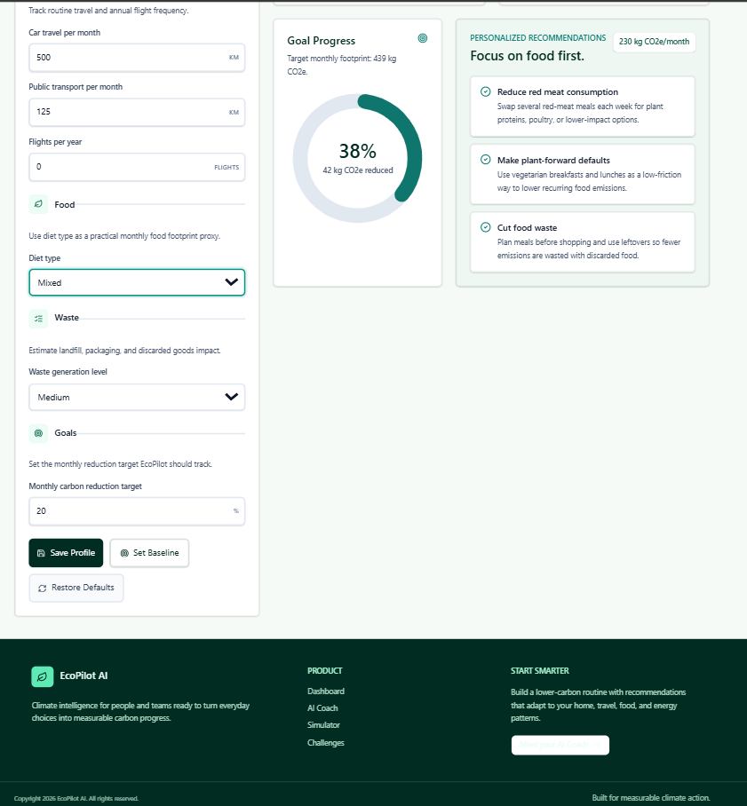
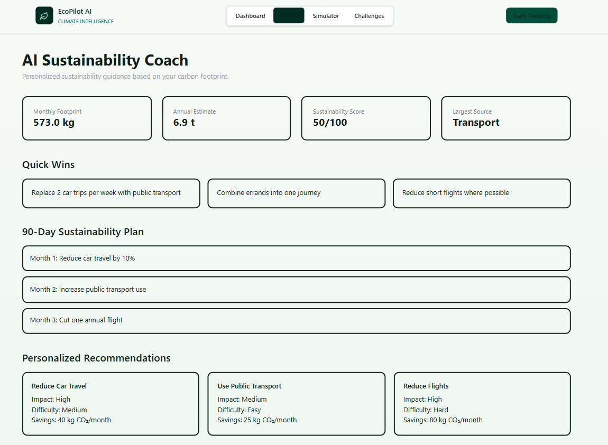
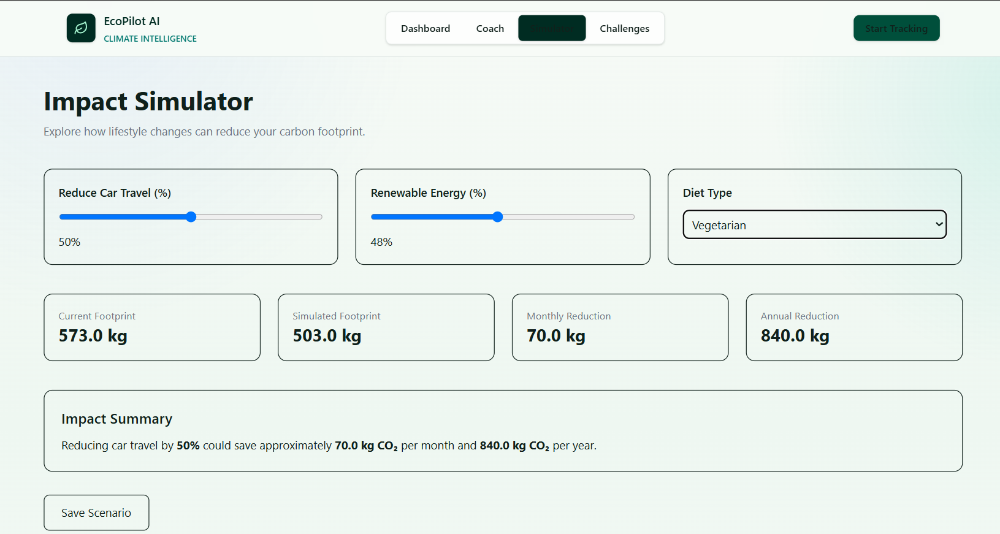
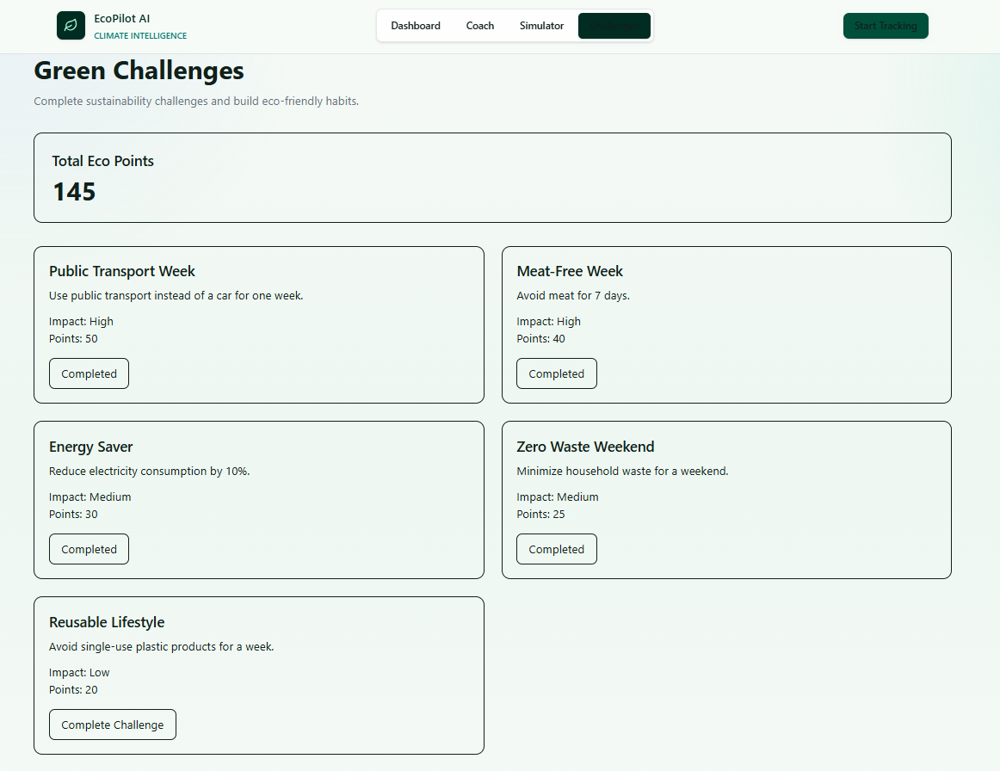

# 🌱 EcoPilot AI – Carbon Footprint Awareness Platform

EcoPilot AI is an intelligent sustainability platform that helps individuals understand, track, and reduce their carbon footprint through personalized insights, actionable recommendations, and interactive simulations.

Built using React, Vite, Tailwind CSS, Recharts, and Local Storage, the platform transforms environmental awareness into measurable action through a modern and user-friendly experience.

---
## 🚀 Live Project

🌐 Live Demo: https://ecopilotai-gamma.vercel.app/

📂 Source Code: https://github.com/Srijeeta977/EcoPilot-AI

Demo video : https://www.linkedin.com/posts/srijeeta-dutta-a06b36318_ecopilotai-climatetech-sustainability-ugcPost-7474312953811398656-H_Jk/?utm_source=share&utm_medium=member_desktop&rcm=ACoAAFCdJSYBh9GXUGk_7Ic17lxz3RWZEW_1Rzk

---
## 📌 Problem Statement

Design a solution that helps individuals understand, track, and reduce their carbon footprint through simple actions and personalized insights.

EcoPilot AI addresses this challenge by providing:

* Carbon footprint estimation
* Personalized sustainability coaching
* Lifestyle impact simulation
* Habit-building eco challenges
* Progress tracking and visual analytics

---

## 🚀 Key Features

### 📊 Carbon Footprint Dashboard

Track and visualize environmental impact through:

* Monthly carbon footprint estimation
* Annual emissions projection
* Sustainability score calculation
* Category-wise emission breakdown
* Progress tracking against reduction goals
* Interactive charts and analytics

---

### 🤖 AI Sustainability Coach

Receive personalized recommendations based on:

* Energy consumption
* Transportation habits
* Dietary choices
* Waste generation patterns
* Sustainability goals

The AI Coach identifies the largest emission contributors and recommends high-impact improvements.

---

### 🔄 Impact Simulator

Experiment with lifestyle changes before implementing them.

Users can simulate:

* Reduced vehicle usage
* Renewable energy adoption
* Dietary improvements
* Flight reductions
* Waste management improvements

The simulator instantly displays projected carbon savings and future impact.

---

### 🌿 Green Challenges

Gamified sustainability engagement through:

* Eco-friendly challenges
* Habit-building activities
* Eco points system
* Progress tracking
* Achievement-based motivation

---

### 📈 Data Visualization

Interactive charts powered by Recharts:

* Carbon source breakdown
* Emission comparison charts
* Progress visualization
* Reduction opportunity analysis

---

## 🏗️ System Architecture

EcoPilot AI follows a modular frontend architecture.

```text
EcoPilot AI
│
├── Home Page
│
├── Dashboard
│   ├── Carbon Calculator
│   ├── Charts
│   └── Progress Tracking
│
├── AI Coach
│   └── Personalized Recommendations
│
├── Impact Simulator
│   └── Lifestyle Change Modelling
│
├── Green Challenges
│   └── Eco Points System
│
└── Local Storage Layer
    ├── User Profile
    ├── Goals
    └── Progress Data
```

---

## ⚙️ Technology Stack

### Frontend

* React.js
* Vite
* Tailwind CSS
* React Router DOM

### Visualization

* Recharts

### Animation

* Framer Motion

### Icons

* Lucide React

### Storage

* Browser Local Storage

### Version Control

* Git
* GitHub

---

## 🧠 Carbon Calculation Methodology

The platform uses a transparent emissions-factor model to estimate carbon footprint.

Factors considered:

### Energy

* Monthly electricity consumption
* Renewable energy percentage

### Transportation

* Car travel
* Public transport usage
* Flight frequency

### Food

* Vegan
* Vegetarian
* Mixed Diet
* High Meat Diet

### Waste

* Low
* Medium
* High waste generation

The calculations are educational estimates and are intended for awareness and behavioral improvement purposes.

---

## 📷 Screenshots

### Home Page







### Dashboard





### AI Coach



### Impact Simulator



### Green Challenges



---

## 📂 Project Structure

```text
src
│
├── assets
├── components
├── context
├── data
├── hooks
├── layouts
├── pages
├── styles
├── utils
│
├── App.jsx
└── main.jsx
```

---

## 🔧 Installation

### Clone Repository

```bash
git clone https://github.com/Srijeeta977/EcoPilot-AI.git
```

### Navigate to Project

```bash
cd EcoPilot-AI
```

### Install Dependencies

```bash
npm install
```

### Start Development Server

```bash
npm run dev
```

### Build Production Version

```bash
npm run build
```

---

## 🎯 Future Enhancements

* Real-time emissions APIs
* User authentication
* Cloud database integration
* AI-powered conversational sustainability assistant
* Community sustainability leaderboards
* Carbon offset recommendations
* Mobile application version
* Multi-language support
* Dark Mode support

---

## ♿ Accessibility Considerations

* Responsive design
* Semantic HTML structure
* Keyboard-friendly navigation
* Accessible color contrasts
* Mobile-first experience

---

## 🔒 Security Considerations

* No sensitive user data collection
* Client-side storage only
* No external tracking scripts
* Safe local persistence mechanisms

---

## 🧪 Testing

The application has been manually tested for:

* Route navigation
* Local storage persistence
* Dashboard calculations
* Simulator projections
* Challenge completion tracking
* Responsive layout behavior

---

## 👩‍💻 Contributor

### Srijeeta Dutta

Developer & Project Owner

GitHub: https://github.com/Srijeeta977

---

## Testing

EcoPilot AI has been tested for:

- Navigation
- Carbon calculations
- Simulator projections
- Challenge tracking
- Local storage persistence
- Responsive layouts

Detailed report:

docs/TESTING.md

---

## Security

- No personal information stored
- Client-side local storage only
- No third-party tracking scripts
- No external API keys exposed

---

## 🌍 Vision

EcoPilot AI aims to make sustainability understandable, measurable, and actionable for everyone.

Small actions create meaningful environmental impact when individuals are empowered with the right information and tools.

---

Copyright (c) 2026 Srijeeta Dutta

All Rights Reserved.

This source code may not be copied, modified, distributed, or used in any form without explicit written permission from the author.
